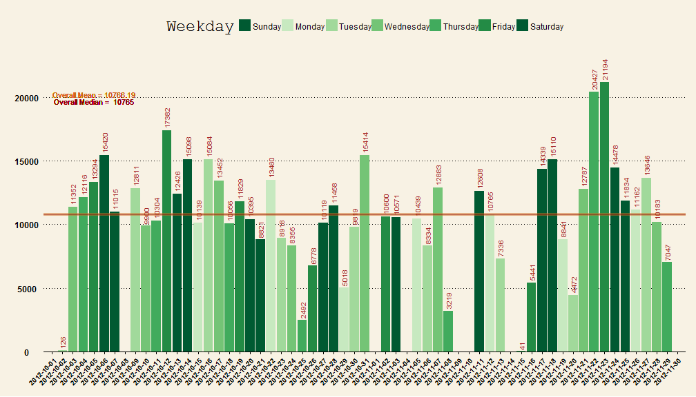
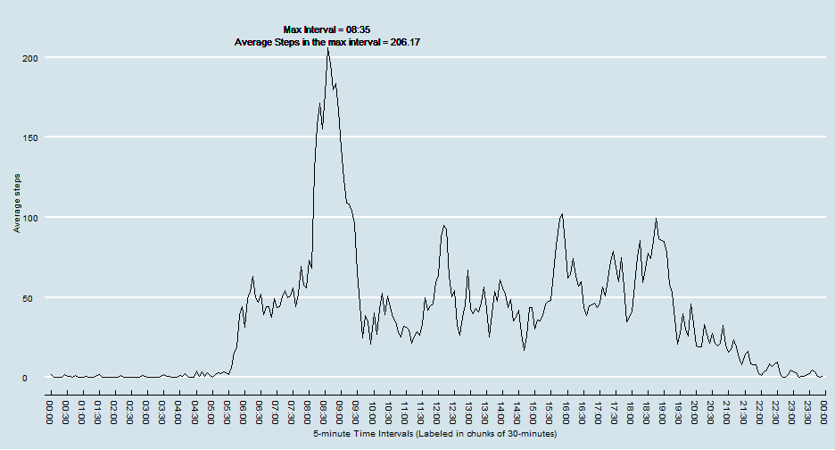
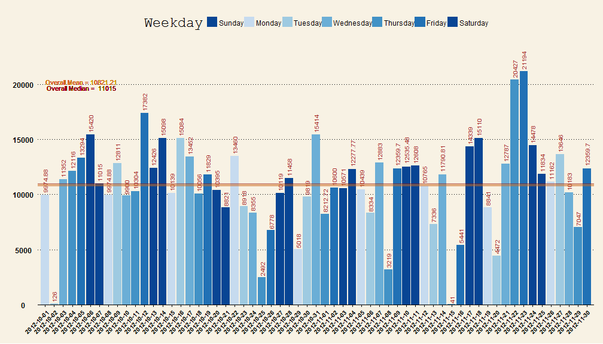
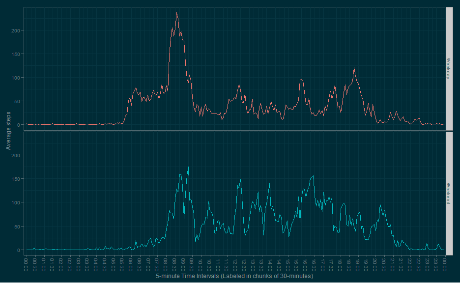

## Loading and preprocessing the data


```r
require(ggplot2)
require(lubridate)
require(RColorBrewer)
require(dplyr)
require(ggthemes)
library(scales)
```


```r
loadData <- function(dataURL="", destF="default.csv", method = NULL){
  if(!file.exists(destF)){
            temp <- tempfile()
            download.file(dataURL, temp, method = method)
            unzip(temp, destF)
            unlink(temp)
        }else{
            message("Data already downloaded.")
        }
}

dataURL <-"https://d396qusza40orc.cloudfront.net/repdata%2Fdata%2Factivity.zip"


## Windows Users:
loadData(dataURL, "activity.csv")
```

```
## Data already downloaded.
```

```r
## Mac Users: 
#loadData(dataURL, "activity.csv", method = "curl")

active <- read.csv("activity.csv")

active$date<-as.Date(active$date)

# Lubridate's wday function can fill in the Weekday's full names as ordered factor variables. Sun to Sat.
# Create a column of these days of the week for each date for subsetting.
active$Weekday<-wday(active$date, label = TRUE, abbr = FALSE)
#Quick look at the data
head(active)
```

```
##   steps       date interval Weekday
## 1    NA 2012-10-01        0  Monday
## 2    NA 2012-10-01        5  Monday
## 3    NA 2012-10-01       10  Monday
## 4    NA 2012-10-01       15  Monday
## 5    NA 2012-10-01       20  Monday
## 6    NA 2012-10-01       25  Monday
```

## What is mean total number of steps taken per day?


```r
# Create function which takes the active dataframe, and an RBrewers color scheme for customization. 

# Color scheme defaults to "Greens"

# Weekend are colored the same dark color to identify better. 

# Weekdays start light on Monday and gradually get darker as they approach the Weekend.

# Creates a plot which:

# 1.) Makes a histogram of the total number of steps taken each day

# 2.) Calculates and reports the mean and median total number of steps taken per day


make.sums.ggplot<- function(active.dataframe, RBrewers.colors = "Greens"){
  
  #Transmform the data and get averages.

  #Sum up steps of the data.frame, grouped by date
  active.sums <- active.dataframe %>%
    group_by(date, Weekday) %>%
    summarise(total_steps = sum(steps))
  
  # Create a vector of brewer greens for representing the ordinal change from Monday to Sunday.
  # Brewer.pal takes an integer (n) and an RBrewer color set. 
  # It then creates (n) gradients of color that cover the passed in color set. 
  # 7 is passed in because there are 7 factors: each day of the week.
  my.cols <- brewer.pal(7, RBrewers.colors)
  # Ordered factors start on Sunday. Rather than reordering the date factor variables, we can just reassign the color for Saturday to Sunday as well. This will make the Weekends stand out.
  my.cols[1] <- my.cols[7]
  # Get max number of steps for largest interval for extending y-axis to fit labels.
  max.sum <- max(active.sums$total_steps, na.rm = TRUE)
  
  
  ggplot(active.sums, aes(x = date, y = total_steps, fill = Weekday)) + geom_bar(stat = "identity") +
    scale_x_date(breaks="1 day", 
                 limits = as.Date(c('2012-10-03','2012-11-28'))) +
    theme_wsj() +    
    theme(axis.text.x  = element_text(size=10,
                                      angle=45,
                                      colour="black",
                                      vjust=1,
                                      hjust=1)) + 
    scale_fill_manual(values = my.cols) + 
    geom_text(aes(x = date, 
                  y = total_steps, 
                  label = total_steps, 
                  angle  = 90, 
                  size = 5, 
                  hjust = -0.1), 
              color = "brown", 
              show_guide  = F) + 

    #theme(panel.grid.minor = element_blank(), 
    #      panel.grid.major = element_blank()) +
    #theme(panel.background = element_rect(fill="darkgrey")) + 
      # Adjust the y axis. Start from 0. 
      # Continue to 15% beyond the max y-value so that the labels don't get cut off.
    coord_cartesian(ylim=c(0,max.sum*1.15)) +
    geom_hline(aes ( yintercept = mean(total_steps, na.rm = TRUE)), 
               color = "chocolate3", 
               size = 1.5, 
               alpha = .50) + 
    geom_hline(aes ( yintercept = median(total_steps, na.rm = TRUE)), 
               color = "darkred", 
               alpha = .50) +
    geom_text(aes(label = paste("Overall Mean =", round(mean(total_steps, na.rm = TRUE), 2) ),
                  x = as.Date('2012-10-05'),
                  y = 20200), 
              color = "chocolate3", 
              size = 4) +
    geom_text(aes(label = paste("Overall Median = ", round(median(total_steps, na.rm = TRUE), 2) ),
                  x = as.Date('2012-10-05'),
                  y = 19700),
              color = "darkred",
              size = 4) +
    ylab("Total Steps taken per day") +
    xlab(NULL)
}

make.sums.ggplot(active, "Greens")
```

```
## Warning: Removed 8 rows containing missing values (position_stack).
## Warning: Removed 8 rows containing missing values (geom_text).
```

 

```r
# 8 rows/days are missing and not plotted
```

## What is the average daily activity pattern?


```r
# Create a function which:

# 1.) Makes a time series plot (i.e. type = "l") of the 5-minute interval (x-axis) and the average number of steps taken, averaged across all days (y-axis) This plotted in 5 minute intervals but labeled in 30 minute intervals to reduce labeling clutter.

# 2.) Reports the 5-minute interval, on average across all the days in the dataset, which contains the maximum number of steps


# 5 interval column data is from 0-60, then 100-160, etc.
# Converts 5 minute interval data to POSIXct format (60 minutes in an hour)

active$Interval <- as.POSIXct(strptime(sprintf("%04d", active$interval), "%H%M")) 


make.max.interval.ggplot<- function(active.dataframe){

    # Use dplyr's piping functions to transform data 
    # then pass that transformed data to the next transform function.
  active.intervals <- active.dataframe %>%
    group_by(Interval) %>%
    summarise(Average = mean(steps, na.rm = TRUE)) %>%
    arrange(Interval)

    # Pulls out the row which had the max average into a one row data.frame
  max.active <- active.intervals[which.max(active.intervals$Average),]
    # Grab the max interval for plotting. 
    # Assign to global environment since ggplot can't find it when called from within a function.
  max.interval <<- max.active$Interval[1]
    # Grab the average steps for plotting.
  max.average <<- round(max.active$Average[1], 2)

  
  ggplot(active.intervals, aes(x = Interval, y = Average)) +
    geom_line() +
    theme_economist() +
    geom_text(aes(label = paste("Max Interval =", format(max.interval, "%H:%M")),
                  x = max.interval,
                  y = max.average + 12),
              color = "black",
              size = 4) +
    geom_text(aes(label = paste("Average Steps in the max interval =", max.average ),
                  x = max.interval,
                  y = max.average + 4),
              color = "black",
              size = 4) + 
    theme(axis.text.x=element_text(angle=270,
                                   hjust=1,
                                   vjust=0.5,
                                   size = 10)) + 
    scale_x_datetime(breaks = date_breaks("30 mins"),
                     labels = date_format("%H:%M"),
                     limits = c(active.intervals$Interval[12], active.intervals$Interval[286-10])) +
    ylab("Average steps") + 
    xlab("5-minute Time Intervals (Labeled in chunks of 30-minutes)")
}

make.max.interval.ggplot(active)
```

 

## Imputing missing values


```r
# 1.) Calculate and report the total number of missing values in the dataset (i.e. the total number of rows with NAs)

# NA's :2304 
summary(active)
```

```
##      steps            date               interval         Weekday    
##  Min.   :  0.0   Min.   :2012-10-01   Min.   :   0   Sunday   :2304  
##  1st Qu.:  0.0   1st Qu.:2012-10-16   1st Qu.: 589   Monday   :2592  
##  Median :  0.0   Median :2012-10-31   Median :1178   Tuesday  :2592  
##  Mean   : 37.4   Mean   :2012-10-31   Mean   :1178   Wednesday:2592  
##  3rd Qu.: 12.0   3rd Qu.:2012-11-15   3rd Qu.:1766   Thursday :2592  
##  Max.   :806.0   Max.   :2012-11-30   Max.   :2355   Friday   :2592  
##  NA's   :2304                                        Saturday :2304  
##     Interval                  
##  Min.   :2014-07-18 00:00:00  
##  1st Qu.:2014-07-18 05:58:45  
##  Median :2014-07-18 11:57:30  
##  Mean   :2014-07-18 11:57:30  
##  3rd Qu.:2014-07-18 17:56:15  
##  Max.   :2014-07-18 23:55:00  
## 
```

```r
# Subset out all rows with an NA value, 2304 rows
NA.active <- subset(active, !complete.cases(active))
# All NAs are contained in 8 days, which have all steps missing in each day 
table(NA.active$date)
```

```
## 
## 2012-10-01 2012-10-08 2012-11-01 2012-11-04 2012-11-09 2012-11-10 
##        288        288        288        288        288        288 
## 2012-11-14 2012-11-30 
##        288        288
```


```r
# 2.) We will impute the values by filling in the mean of the steps in each interval. 

# For example, to fill in NA's on Monday's at 12:00, all "12:00 - 12:05" intervals for all Monday's will be used to get the imputed value.

# The same will be done for Tuesday's in this time period, etc. So that each unique day has different means in each time interval.

#Initial step:
# Create function that gets breakdown of an interval, by Weekday


interval.summary <- function(active_frame, interval_string = "all"){
    # '''
    # Takes dataframe with Interval, Weekday, and steps data.
    # Takes optional string value specifying which interval means to return.
    # If no interval data is supplied, or "all" is entered, all intervals will be returned.
    #   
    # Returns a dataframe containing Interval (all if none specified), Weekday, and Average. 
    # '''
  
  active_frame$temp_time <- format(active_frame$Interval, "%H:%M")
  
  if (class(interval_string) != "character") {stop("Please enter an interval as a string.")}
  if (!(interval_string %in% c( active_frame$temp_time, "all" ) ) ) {stop("Please enter a 5 minute interval in the form of 00:00")}
  
  output <- active_frame %>% 
    group_by(temp_time, Weekday) %>%
    summarise(Average = mean(steps, na.rm = TRUE))
  if (interval_string == "all") {
    return(output)
    } else {
      output<- output %>%
        filter(temp_time == interval_string)
      return(output)
      }
  }

# Here we show the averages for max interval, 8:35, on each different day.
interval.summary(active, "08:35")
```

```
## Source: local data frame [7 x 3]
## Groups: temp_time
## 
##   temp_time   Weekday Average
## 1     08:35    Sunday   101.1
## 2     08:35    Monday   225.9
## 3     08:35   Tuesday   154.9
## 4     08:35 Wednesday   273.0
## 5     08:35  Thursday   252.1
## 6     08:35    Friday   279.1
## 7     08:35  Saturday   155.6
```


```r
# To impute, we subgroup the data by Weekday and Interval and fill in any missing values with the average for that particular Interval/Weekday combination using the dplyr package.

imputed <- active %>%
  mutate(steps = as.numeric(steps)) %>%
  group_by(Interval, Weekday) %>%
  mutate(steps = ifelse(is.na(steps), mean(steps, na.rm = TRUE), steps)) %>%
  mutate(steps = round(steps, 2))
```


```r
# Calling our previous function, the means, min and max, don't change, and now NA's are filled in.

#interval.summary(imputed, 835) #Not called in RMarkdown for brevity

#interval.summary(active, 835) #Not called in RMarkdown for brevity

## Needs docstring: Accepts (df, df, int, string) type combination

# Integrity check function to make sure imputation went as planned.
imputed.check<- function(original.df, imputed.df, check.interval, check.Weekday) {
  print ("Original interval/day combination")
  print (subset(original.df, original.df$interval == check.interval & Weekday == check.Weekday))
  # Mean without the NAs for this interval/day combination is 225.8571
  temp.mean <- mean(subset(original.df, original.df$interval == check.interval & Weekday == check.Weekday)$steps, na.rm = TRUE)
  print ("")
  print (paste("Mean for original dataset (with na.rm = TRUE) NAs is:", round(temp.mean, 2)))
  print ("")
  # This mean is filled into the NA slots, while the remaining values remain unchanged.
  print ("Imputed interval/day combination")
  print (subset(imputed.df, imputed.df$interval == check.interval & Weekday == check.Weekday))
}


# Integrity Check #1:
imputed.check(active, imputed, 835, "Monday")
```

```
## [1] "Original interval/day combination"
##       steps       date interval Weekday            Interval
## 104      NA 2012-10-01      835  Monday 2014-07-18 08:35:00
## 2120     NA 2012-10-08      835  Monday 2014-07-18 08:35:00
## 4136    786 2012-10-15      835  Monday 2014-07-18 08:35:00
## 6152     25 2012-10-22      835  Monday 2014-07-18 08:35:00
## 8168     56 2012-10-29      835  Monday 2014-07-18 08:35:00
## 10184   131 2012-11-05      835  Monday 2014-07-18 08:35:00
## 12200   534 2012-11-12      835  Monday 2014-07-18 08:35:00
## 14216    44 2012-11-19      835  Monday 2014-07-18 08:35:00
## 16232     5 2012-11-26      835  Monday 2014-07-18 08:35:00
## [1] ""
## [1] "Mean for original dataset (with na.rm = TRUE) NAs is: 225.86"
## [1] ""
## [1] "Imputed interval/day combination"
## Source: local data frame [9 x 5]
## Groups: 
## 
##       steps       date interval Weekday            Interval
## 104   225.9 2012-10-01      835  Monday 2014-07-18 08:35:00
## 2120  225.9 2012-10-08      835  Monday 2014-07-18 08:35:00
## 4136  786.0 2012-10-15      835  Monday 2014-07-18 08:35:00
## 6152   25.0 2012-10-22      835  Monday 2014-07-18 08:35:00
## 8168   56.0 2012-10-29      835  Monday 2014-07-18 08:35:00
## 10184 131.0 2012-11-05      835  Monday 2014-07-18 08:35:00
## 12200 534.0 2012-11-12      835  Monday 2014-07-18 08:35:00
## 14216  44.0 2012-11-19      835  Monday 2014-07-18 08:35:00
## 16232   5.0 2012-11-26      835  Monday 2014-07-18 08:35:00
```

```r
# Quick check on the rows of all Mondays in interval 835 in the original set vs. the imputed set

# Mean without the NAs for this interval/day combination is 225.86

# This mean is filled into the NA slots, while the remaining values remain unchanged.


# Integrity Check #2:
imputed.check(active, imputed, 1005, "Thursday")
```

```
## [1] "Original interval/day combination"
##       steps       date interval  Weekday            Interval
## 986       0 2012-10-04     1005 Thursday 2014-07-18 10:05:00
## 3002      0 2012-10-11     1005 Thursday 2014-07-18 10:05:00
## 5018      0 2012-10-18     1005 Thursday 2014-07-18 10:05:00
## 7034      0 2012-10-25     1005 Thursday 2014-07-18 10:05:00
## 9050     NA 2012-11-01     1005 Thursday 2014-07-18 10:05:00
## 11066     0 2012-11-08     1005 Thursday 2014-07-18 10:05:00
## 13082     0 2012-11-15     1005 Thursday 2014-07-18 10:05:00
## 15098     0 2012-11-22     1005 Thursday 2014-07-18 10:05:00
## 17114     0 2012-11-29     1005 Thursday 2014-07-18 10:05:00
## [1] ""
## [1] "Mean for original dataset (with na.rm = TRUE) NAs is: 0"
## [1] ""
## [1] "Imputed interval/day combination"
## Source: local data frame [9 x 5]
## Groups: 
## 
##       steps       date interval  Weekday            Interval
## 986       0 2012-10-04     1005 Thursday 2014-07-18 10:05:00
## 3002      0 2012-10-11     1005 Thursday 2014-07-18 10:05:00
## 5018      0 2012-10-18     1005 Thursday 2014-07-18 10:05:00
## 7034      0 2012-10-25     1005 Thursday 2014-07-18 10:05:00
## 9050      0 2012-11-01     1005 Thursday 2014-07-18 10:05:00
## 11066     0 2012-11-08     1005 Thursday 2014-07-18 10:05:00
## 13082     0 2012-11-15     1005 Thursday 2014-07-18 10:05:00
## 15098     0 2012-11-22     1005 Thursday 2014-07-18 10:05:00
## 17114     0 2012-11-29     1005 Thursday 2014-07-18 10:05:00
```

```r
# Quick check on the rows of all Thursday in interval 1005 in the original set vs. the imputed set. Zero is filled into this interval/day combination since it is all zeros.


# Integrity Check #3:
imputed.check(active, imputed, 1600, "Saturday")
```

```
## [1] "Original interval/day combination"
##       steps       date interval  Weekday            Interval
## 1633     27 2012-10-06     1600 Saturday 2014-07-18 16:00:00
## 3649      0 2012-10-13     1600 Saturday 2014-07-18 16:00:00
## 5665     53 2012-10-20     1600 Saturday 2014-07-18 16:00:00
## 7681      0 2012-10-27     1600 Saturday 2014-07-18 16:00:00
## 9697      0 2012-11-03     1600 Saturday 2014-07-18 16:00:00
## 11713    NA 2012-11-10     1600 Saturday 2014-07-18 16:00:00
## 13729     0 2012-11-17     1600 Saturday 2014-07-18 16:00:00
## 15745   785 2012-11-24     1600 Saturday 2014-07-18 16:00:00
## [1] ""
## [1] "Mean for original dataset (with na.rm = TRUE) NAs is: 123.57"
## [1] ""
## [1] "Imputed interval/day combination"
## Source: local data frame [8 x 5]
## Groups: 
## 
##       steps       date interval  Weekday            Interval
## 1633   27.0 2012-10-06     1600 Saturday 2014-07-18 16:00:00
## 3649    0.0 2012-10-13     1600 Saturday 2014-07-18 16:00:00
## 5665   53.0 2012-10-20     1600 Saturday 2014-07-18 16:00:00
## 7681    0.0 2012-10-27     1600 Saturday 2014-07-18 16:00:00
## 9697    0.0 2012-11-03     1600 Saturday 2014-07-18 16:00:00
## 11713 123.6 2012-11-10     1600 Saturday 2014-07-18 16:00:00
## 13729   0.0 2012-11-17     1600 Saturday 2014-07-18 16:00:00
## 15745 785.0 2012-11-24     1600 Saturday 2014-07-18 16:00:00
```

```r
# Quick check on the rows of all Thursday in interval 1600 in the original set vs. the imputed set. This value is filled in correctly as well.
```


```r
#4.) Make a histogram of the total number of steps taken each day and Calculate and report the mean and median total number of steps taken per day.  

# Call our make.sums.ggplot to make a new plot with the imputed dataset

# The mean and median changed slightly since the missing/imputed days were fairly busy days in general in the dataset.
make.sums.ggplot(imputed, "Blues")
```

 

```r
# Do these values differ from the estimates from the first part of the assignment?

# What is the impact of imputing missing data on the estimates of the total daily number of steps?

# The original averages for each day that wasn't NA remain unchanged, but new bars from the summation of averages of each interval of each day for now present.

# The overall values are slightly higher because the imputed days that were missing tended to be busier days of the week with more steps.
```

## Are there differences in activity patterns between Weekdays and Weekends?


```r
# 1.) Add Weekend column

imputed<- imputed %>% 
  mutate(Weekend = ifelse(Weekday %in% c("Saturday", "Sunday"), "Weekend", "Weekday"))

# Make sure function worked with table()
table(imputed$Weekend, imputed$Weekday)
```

```
##          
##           Sunday Monday Tuesday Wednesday Thursday Friday Saturday
##   Weekday      0   2592    2592      2592     2592   2592        0
##   Weekend   2304      0       0         0        0      0     2304
```


```r
# 2.) Makes a panel plot containing a time series plot (i.e. type = "l") of the 5-minute interval (x-axis) and the average number of steps taken, averaged across all Weekday days or Weekend days (y-axis). 

make.Weekend.ggplot<- function(active.dataframe){
    
  #Transmform the data and get averages.
    
  active.intervals <- active.dataframe %>%
    group_by(Weekend, Interval) %>%
    summarise(Average = mean(steps, na.rm = TRUE))
  
  #active.intervals<- cbind(active.intervals)
  ggplot(active.intervals, aes(x = Interval, 
                               y = Average, 
                               group = Weekend, 
                               color = Weekend)) +
    theme_solarized(light = FALSE) +
    geom_line() +
    facet_grid(Weekend~.) +
    theme(axis.text.x=element_text(angle=270,hjust=1,vjust=0.5, size = 10)) + 
    scale_x_datetime(breaks = date_breaks("30 mins"),
                     labels = date_format("%H:%M"),
                     limits = c(active.intervals$Interval[12], active.intervals$Interval[286-10])) +
    ylab("Average steps") + 
    xlab("5-minute Time Intervals (Labeled in chunks of 30-minutes)") +
    theme(legend.position="none")
    #scale_x_discrete(breaks = active.intervals$Interval, labels=rep(times,2)) +
   # theme(axis.text.x=element_text(angle=90,hjust=1,vjust=0.5, size = 0.5))
}

make.Weekend.ggplot(imputed)
```

 

```r
# Here we can see the participant gets up around 5:30am on Weekdays (presumably for work) and takes by far the most steps of the week on Weekdays between 8:15am and 8:45am (maybe walking to work?). 

# On the Weekends, activity is more sluggish until around 8:00am, but there is more activity during the day on average.  

# Generally, by 20:00 (8pm) most activity has stopped on Weekdays, while Weekends show surges of activity until 21:30 (9:30pm).
```


