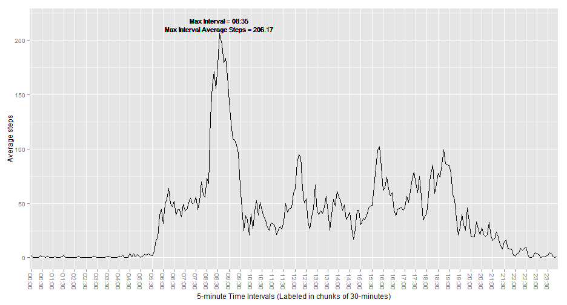
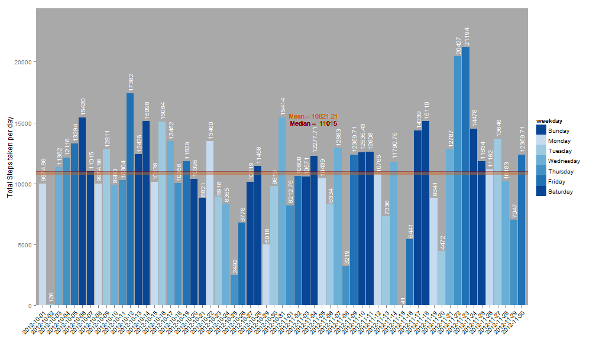
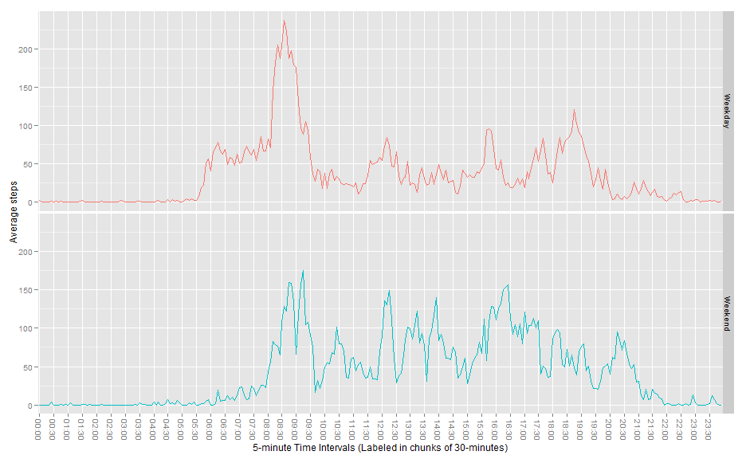

# Reproducible Research: Peer Assessment 1
========================================================

## Loading and preprocessing the data


```
## Loading required package: data.table
## Loading required package: ggplot2
## Loading required package: lubridate
## 
## Attaching package: 'lubridate'
## 
## The following objects are masked from 'package:data.table':
## 
##     hour, mday, month, quarter, wday, week, yday, year
## 
## Loading required package: RColorBrewer
```


```r
# url<-
# 'https://d396qusza40orc.cloudfront.net/repdata%2Fdata%2Factivity.zip'
# download.file(url, 'activity.zip') closeAllConnections()
unzip("activity.zip", "activity.csv")
active <- fread("activity.csv")
active$date <- as.Date(active$date)
# Lubridate's wday function can fill in the Weekday's full names as ordered
# factor variables. Sun to Sat.  Create a column of these days of the week
# for each date for subsetting.
active$weekday <- wday(active$date, label = TRUE, abbr = FALSE)

# Quick look at the data
active
```

```
##        steps       date interval weekday
##     1:    NA 2012-10-01        0  Monday
##     2:    NA 2012-10-01        5  Monday
##     3:    NA 2012-10-01       10  Monday
##     4:    NA 2012-10-01       15  Monday
##     5:    NA 2012-10-01       20  Monday
##    ---                                  
## 17564:    NA 2012-11-30     2335  Friday
## 17565:    NA 2012-11-30     2340  Friday
## 17566:    NA 2012-11-30     2345  Friday
## 17567:    NA 2012-11-30     2350  Friday
## 17568:    NA 2012-11-30     2355  Friday
```


## What is mean total number of steps taken per day?


```r
# Create function which takes the active dataframe, and an RBrewers color
# scheme for customization.

# Color scheme defaults to 'Greens'

# Weekend are colored the same dark color to identify better.

# Weekdays start light on Monday and gradually get darker as they approach
# the weekend.

# Creates a plot which:

# 1.) Makes a histogram of the total number of steps taken each day

# 2.) Calculates and reports the mean and median total number of steps taken
# per day

make.sums.ggplot <- function(active.dataframe, RBrewers.colors = "Greens") {
    
    # Transmform the data and get averages.
    
    # Sum up all the variables of the data.frame/data.table, grouped by date
    active.sums <- active.dataframe[, lapply(.SD, sum), by = date]
    # Add our weekdays back in
    active.sums$steps <- round(active.sums$steps, 2)
    active.sums$weekday <- wday(active.sums$date, label = TRUE, abbr = FALSE)
    head(active.sums)
    # Create a vector of brewer greens for representing the ordinal change from
    # Monday to Sunday.
    
    # 7 is passed in because there are 7 factors: each day of the week.
    my.cols <- brewer.pal(7, RBrewers.colors)
    # Ordered factors start on Sunday. Rather than reordering the date factor
    # variables, we can just reassign the color for Saturday to Sunday as well.
    # This will make the weekends stand out.
    my.cols[1] <- my.cols[7]
    # Get max number of steps for largest interval for extending y-axis to fit
    # labels.
    max.sum <- max(active.sums$steps, na.rm = TRUE)
    
    
    ggplot(active.sums, aes(x = date, y = steps, fill = weekday)) + geom_bar(stat = "identity") + 
        scale_x_date(breaks = "1 day", limits = as.Date(c("2012-10-03", "2012-11-28"))) + 
        theme(axis.text.x = element_text(size = 10, angle = 45, colour = "black", 
            vjust = 1, hjust = 1)) + scale_fill_manual(values = my.cols) + geom_text(aes(x = date, 
        y = steps, label = steps, angle = 90, size = 5, hjust = -0.1), color = "white", 
        show_guide = F) + theme(panel.grid.minor = element_blank(), panel.grid.major = element_blank()) + 
        theme(panel.background = element_rect(fill = "darkgrey")) + coord_cartesian(ylim = c(0, 
        max.sum * 1.15)) + geom_hline(aes(yintercept = mean(steps, na.rm = TRUE)), 
        color = "chocolate3", size = 1.5, alpha = 0.5) + geom_hline(aes(yintercept = median(steps, 
        na.rm = TRUE)), color = "darkred", alpha = 0.5) + geom_text(aes(label = paste("Mean =", 
        round(mean(steps, na.rm = TRUE), 2)), x = as.Date("2012-11-04"), y = 15600), 
        color = "chocolate3", size = 4) + geom_text(aes(label = paste("Median = ", 
        round(median(steps, na.rm = TRUE), 2)), x = as.Date("2012-11-04"), y = 15000), 
        color = "darkred", size = 4) + ylab("Total Steps taken per day") + xlab(NULL)
}

make.sums.ggplot(active, "Greens")
```

```
## Warning: Removed 8 rows containing missing values (position_stack).
## Warning: Removed 8 rows containing missing values (geom_text).
```

 

```r

# 8 rows/days are missing and not plotted
```


## What is the average daily activity pattern?


```r

# Create a function which:

# 1.) Makes a time series plot (i.e. type = 'l') of the 5-minute interval
# (x-axis) and the average number of steps taken, averaged across all days
# (y-axis) This plotted in 5 minute intervals but labeled in 30 minute
# intervals to reduce labeling clutter.

# 2.) Reports the 5-minute interval, on average across all the days in the
# dataset, wihch contains the maximum number of steps

make.max.interval.ggplot <- function(active.dataframe) {
    active.dataframe$times <- as.factor(sprintf("%02d:%02d", active.dataframe$interval%/%100, 
        active.dataframe$interval%%100))
    active.intervals <- active.dataframe[, mean(steps, na.rm = TRUE), by = times]
    
    setnames(active.intervals, c("Interval", "Average"))
    
    max.active <- active.intervals[which.max(active.intervals$Average), ]
    max.interval <<- max.active$Interval[1]
    max.average <<- round(max.active$Average[1], 2)
    
    ggplot(active.intervals, aes(x = Interval, y = Average, group = 1)) + geom_line() + 
        geom_text(aes(label = paste("Max Interval =", max.interval), x = max.interval, 
            y = max.average + 12), color = "black", size = 4) + geom_text(aes(label = paste("Max Interval Average Steps =", 
        max.average), x = max.interval, y = max.average + 4), color = "black", 
        size = 4) + theme(axis.text.x = element_text(angle = 270, hjust = 1, 
        vjust = 0.5, size = 10)) + scale_x_discrete(breaks = active.intervals$Interval[seq(1, 
        288, by = 6)]) + ylab("Average steps") + xlab("5-minute Time Intervals (Labeled in chunks of 30-minutes)") + 
        theme(legend.position = "none")
}

make.max.interval.ggplot(active)
```

 

```r

```


## Imputing missing values


```r
# 1.) Calculate and report the total number of missing values in the dataset
# (i.e. the total number of rows with NAs)

# NA's :2304
summary(active)
```

```
##      steps            date               interval         weekday    
##  Min.   :  0.0   Min.   :2012-10-01   Min.   :   0   Sunday   :2304  
##  1st Qu.:  0.0   1st Qu.:2012-10-16   1st Qu.: 589   Monday   :2592  
##  Median :  0.0   Median :2012-10-31   Median :1178   Tuesday  :2592  
##  Mean   : 37.4   Mean   :2012-10-31   Mean   :1178   Wednesday:2592  
##  3rd Qu.: 12.0   3rd Qu.:2012-11-15   3rd Qu.:1766   Thursday :2592  
##  Max.   :806.0   Max.   :2012-11-30   Max.   :2355   Friday   :2592  
##  NA's   :2304                                        Saturday :2304
```

```r
# Subset out all rows with an NA value, 2304 rows
NA.active <- subset(active, !complete.cases(active))
# All NAs are contained in 8 days, which have all steps missing for each day
table(NA.active$date)
```

```
## 
## 2012-10-01 2012-10-08 2012-11-01 2012-11-04 2012-11-09 2012-11-10 
##        288        288        288        288        288        288 
## 2012-11-14 2012-11-30 
##        288        288
```


```r
# 2.) We will impute the values by filling in the mean of the steps in each
# interval.

# For example, to fill in NA's on Monday's at 12:00, all '12:00 - 12:05'
# intervals for all Monday's will be used to get the imputed value.

# The same will be done for Tuesday's in this time period, etc. So that each
# unique day has different means in each time interval.

# Initial step: Create function that gets breakdown of an interval, by
# weekday
interval.summary <- function(active.dataframe, interval.number) {
    for (i in unique(active.dataframe$interval)) {
        for (j in unique(active.dataframe$weekday)) if (i == interval.number) {
            print(summary(subset(active.dataframe, active$interval == i & active.dataframe$weekday == 
                j)))
        }
    }
}
# Here we show the max interval, 835
interval.summary(active, 835)
```

```
##      steps            date               interval        weekday 
##  Min.   :  5.0   Min.   :2012-10-01   Min.   :835   Sunday   :0  
##  1st Qu.: 34.5   1st Qu.:2012-10-15   1st Qu.:835   Monday   :9  
##  Median : 56.0   Median :2012-10-29   Median :835   Tuesday  :0  
##  Mean   :225.9   Mean   :2012-10-29   Mean   :835   Wednesday:0  
##  3rd Qu.:332.5   3rd Qu.:2012-11-12   3rd Qu.:835   Thursday :0  
##  Max.   :786.0   Max.   :2012-11-26   Max.   :835   Friday   :0  
##  NA's   :2                                          Saturday :0  
##      steps          date               interval        weekday 
##  Min.   :  0   Min.   :2012-10-02   Min.   :835   Sunday   :0  
##  1st Qu.:  0   1st Qu.:2012-10-16   1st Qu.:835   Monday   :0  
##  Median :  0   Median :2012-10-30   Median :835   Tuesday  :9  
##  Mean   :155   Mean   :2012-10-30   Mean   :835   Wednesday:0  
##  3rd Qu.: 16   3rd Qu.:2012-11-13   3rd Qu.:835   Thursday :0  
##  Max.   :743   Max.   :2012-11-27   Max.   :835   Friday   :0  
##                                                   Saturday :0  
##      steps            date               interval        weekday 
##  Min.   :  0.0   Min.   :2012-10-03   Min.   :835   Sunday   :0  
##  1st Qu.:  0.0   1st Qu.:2012-10-17   1st Qu.:835   Monday   :0  
##  Median :  9.5   Median :2012-10-31   Median :835   Tuesday  :0  
##  Mean   :273.0   Mean   :2012-10-31   Mean   :835   Wednesday:9  
##  3rd Qu.:697.5   3rd Qu.:2012-11-14   3rd Qu.:835   Thursday :0  
##  Max.   :755.0   Max.   :2012-11-28   Max.   :835   Friday   :0  
##  NA's   :1                                          Saturday :0  
##      steps          date               interval        weekday 
##  Min.   :  0   Min.   :2012-10-04   Min.   :835   Sunday   :0  
##  1st Qu.:  0   1st Qu.:2012-10-18   1st Qu.:835   Monday   :0  
##  Median : 45   Median :2012-11-01   Median :835   Tuesday  :0  
##  Mean   :252   Mean   :2012-11-01   Mean   :835   Wednesday:0  
##  3rd Qu.:504   3rd Qu.:2012-11-15   3rd Qu.:835   Thursday :9  
##  Max.   :757   Max.   :2012-11-29   Max.   :835   Friday   :0  
##  NA's   :1                                        Saturday :0  
##      steps          date               interval        weekday 
##  Min.   :  0   Min.   :2012-10-05   Min.   :835   Sunday   :0  
##  1st Qu.:  0   1st Qu.:2012-10-19   1st Qu.:835   Monday   :0  
##  Median : 34   Median :2012-11-02   Median :835   Tuesday  :0  
##  Mean   :279   Mean   :2012-11-02   Mean   :835   Wednesday:0  
##  3rd Qu.:589   3rd Qu.:2012-11-16   3rd Qu.:835   Thursday :0  
##  Max.   :742   Max.   :2012-11-30   Max.   :835   Friday   :9  
##  NA's   :2                                        Saturday :0  
##      steps          date               interval        weekday 
##  Min.   :  0   Min.   :2012-10-06   Min.   :835   Sunday   :0  
##  1st Qu.:  0   1st Qu.:2012-10-18   1st Qu.:835   Monday   :0  
##  Median : 67   Median :2012-10-30   Median :835   Tuesday  :0  
##  Mean   :156   Mean   :2012-10-30   Mean   :835   Wednesday:0  
##  3rd Qu.:239   3rd Qu.:2012-11-11   3rd Qu.:835   Thursday :0  
##  Max.   :544   Max.   :2012-11-24   Max.   :835   Friday   :0  
##  NA's   :1                                        Saturday :8  
##      steps          date               interval        weekday 
##  Min.   :  0   Min.   :2012-10-07   Min.   :835   Sunday   :8  
##  1st Qu.:  0   1st Qu.:2012-10-19   1st Qu.:835   Monday   :0  
##  Median : 14   Median :2012-10-31   Median :835   Tuesday  :0  
##  Mean   :101   Mean   :2012-10-31   Mean   :835   Wednesday:0  
##  3rd Qu.:102   3rd Qu.:2012-11-12   3rd Qu.:835   Thursday :0  
##  Max.   :489   Max.   :2012-11-25   Max.   :835   Friday   :0  
##  NA's   :1                                        Saturday :0
```


```r

# We can use this same process to get breakdowns of each interval for each
# weekday, and fill in the NAs with the mean of each interval depending on
# the day just in case there is a significant difference between intervals
# depending on the day of the week. (i.e. Weekends may differ from Weekdays)


impute.active <- function(active.dataframe) {
    
    imputed <- active
    # Create an empty.frame with the same structure to append the imputed rows
    # to. This is to rebuild the df, with the mean of each interval/weekday
    # combination used to fill each NA.
    imputed <- imputed[which(is.na(imputed$text)), ]
    imputed
    
    for (i in unique(active$interval)) {
        for (j in unique(active$weekday)) {
            temp.df <- subset(active, active$interval == i & active$weekday == 
                j)
            temp.mean <- mean(temp.df$steps, na.rm = TRUE)
            temp.df$steps[is.na(temp.df$steps)] <- temp.mean
            imputed <- rbind(imputed, temp.df)
        }
    }
    # http://stackoverflow.com/questions/1296646/how-to-sort-a-dataframe-by-columns-in-r
    imputed <- imputed[order(date, interval)]
    return(imputed)
}


# Pass the original database into the function and assign the resulting
# database with imputed values to 'imputed'

# 3.) Create a new dataset that is equal to the original dataset but with
# the missing data filled in.

imputed <- impute.active(active)
```

```
## Warning: is.na() applied to non-(list or vector) of type 'NULL'
```


```r

# Calling our previous function, the means, min and max, don't change, and
# now NA's are filled in.

# interval.summary(imputed, 835) #Not called in RMarkdown for brevity

# interval.summary(active, 835) #Not called in RMarkdown for brevity

## Needs docstring: Accepts (df, df, int, string) type combination

# Integrity check function to make sure imputation went as planned.
imputed.check <- function(original.df, imputed.df, check.interval, check.weekday) {
    print("Original interval/day combination")
    print(subset(active, active$interval == check.interval & weekday == check.weekday))
    # Mean without the NAs for this interval/day combination is 225.8571
    temp.mean <- mean(subset(active, active$interval == check.interval & weekday == 
        check.weekday)$steps, na.rm = TRUE)
    print(paste("Mean for original dataset without NAs is:", temp.mean))
    print("")
    # This mean is filled into the NA slots, while the remaining values remain
    # unchanged.
    print("Imputed interval/day combination")
    print(subset(imputed, active$interval == check.interval & weekday == check.weekday))
}


# Integrity Check #1:
imputed.check(active, imputed, 835, "Monday")
```

```
## [1] "Original interval/day combination"
##    steps       date interval weekday
## 1:    NA 2012-10-01      835  Monday
## 2:    NA 2012-10-08      835  Monday
## 3:   786 2012-10-15      835  Monday
## 4:    25 2012-10-22      835  Monday
## 5:    56 2012-10-29      835  Monday
## 6:   131 2012-11-05      835  Monday
## 7:   534 2012-11-12      835  Monday
## 8:    44 2012-11-19      835  Monday
## 9:     5 2012-11-26      835  Monday
## [1] "Mean for original dataset without NAs is: 225.857142857143"
## [1] ""
## [1] "Imputed interval/day combination"
##    steps       date interval weekday
## 1: 225.9 2012-10-01      835  Monday
## 2: 225.9 2012-10-08      835  Monday
## 3: 786.0 2012-10-15      835  Monday
## 4:  25.0 2012-10-22      835  Monday
## 5:  56.0 2012-10-29      835  Monday
## 6: 131.0 2012-11-05      835  Monday
## 7: 534.0 2012-11-12      835  Monday
## 8:  44.0 2012-11-19      835  Monday
## 9:   5.0 2012-11-26      835  Monday
```

```r
# Quick check on the rows of all Mondays in interval 835 in the original set
# vs. the imputed set

# Mean without the NAs for this interval/day combination is 225.8571

# This mean is filled into the NA slots, while the remaining values remain
# unchanged.


# Integrity Check #2:
imputed.check(active, imputed, 1005, "Thursday")
```

```
## [1] "Original interval/day combination"
##    steps       date interval  weekday
## 1:     0 2012-10-04     1005 Thursday
## 2:     0 2012-10-11     1005 Thursday
## 3:     0 2012-10-18     1005 Thursday
## 4:     0 2012-10-25     1005 Thursday
## 5:    NA 2012-11-01     1005 Thursday
## 6:     0 2012-11-08     1005 Thursday
## 7:     0 2012-11-15     1005 Thursday
## 8:     0 2012-11-22     1005 Thursday
## 9:     0 2012-11-29     1005 Thursday
## [1] "Mean for original dataset without NAs is: 0"
## [1] ""
## [1] "Imputed interval/day combination"
##    steps       date interval  weekday
## 1:     0 2012-10-04     1005 Thursday
## 2:     0 2012-10-11     1005 Thursday
## 3:     0 2012-10-18     1005 Thursday
## 4:     0 2012-10-25     1005 Thursday
## 5:     0 2012-11-01     1005 Thursday
## 6:     0 2012-11-08     1005 Thursday
## 7:     0 2012-11-15     1005 Thursday
## 8:     0 2012-11-22     1005 Thursday
## 9:     0 2012-11-29     1005 Thursday
```

```r
# Quick check on the rows of all Thursday in interval 1005 in the original
# set vs. the imputed set. Zero is filled into this interval/day combination
# since it is all zeros.


# Integrity Check #3:
imputed.check(active, imputed, 1600, "Saturday")
```

```
## [1] "Original interval/day combination"
##    steps       date interval  weekday
## 1:    27 2012-10-06     1600 Saturday
## 2:     0 2012-10-13     1600 Saturday
## 3:    53 2012-10-20     1600 Saturday
## 4:     0 2012-10-27     1600 Saturday
## 5:     0 2012-11-03     1600 Saturday
## 6:    NA 2012-11-10     1600 Saturday
## 7:     0 2012-11-17     1600 Saturday
## 8:   785 2012-11-24     1600 Saturday
## [1] "Mean for original dataset without NAs is: 123.571428571429"
## [1] ""
## [1] "Imputed interval/day combination"
##    steps       date interval  weekday
## 1:  27.0 2012-10-06     1600 Saturday
## 2:   0.0 2012-10-13     1600 Saturday
## 3:  53.0 2012-10-20     1600 Saturday
## 4:   0.0 2012-10-27     1600 Saturday
## 5:   0.0 2012-11-03     1600 Saturday
## 6: 123.6 2012-11-10     1600 Saturday
## 7:   0.0 2012-11-17     1600 Saturday
## 8: 785.0 2012-11-24     1600 Saturday
```

```r
# Quick check on the rows of all Thursday in interval 1600 in the original
# set vs. the imputed set. This value is filled in correctly as well.
```


```r

# 4.) Make a histogram of the total number of steps taken each day and
# Calculate and report the mean and median total number of steps taken per
# day.

# Call our make.sums.ggplot to make a new plot with the imputed dataset

# The mean and median changed slightly since the missing/imputed days were
# fairly busy days in general in the dataset.
make.sums.ggplot(imputed, "Blues")
```

 

```r


# Do these values differ from the estimates from the first part of the
# assignment?

# What is the impact of imputing missing data on the estimates of the total
# daily number of steps?

# The original averages for each day that wasn't NA remain unchanged, but
# new bars from the summation of averages of each interval of each day for
# now present.

# The overall values are slightly higher because the imputed days that were
# missing tended to be busier days of the week with more steps.

```


## Are there differences in activity patterns between weekdays and weekends?


```r
# 1.) Creates a new factor variable in the dataset with two levels -
# 'weekday' and 'weekend' indicating whether a given date is a weekday or
# weekend day.

# Function to add weekend/weekday factor to a dataframe that has a weekdays
# column

make.weekends <- function(active.df) {
    active.df$weekend <- as.character(active.df$weekday)
    active.df$weekend[active.df$weekend == "Saturday" | active.df$weekend == 
        "Sunday"] <- "Weekend"
    active.df$weekend[active.df$weekend != "Weekend"] <- "Weekday"
    active.df$weekend <- factor(active.df$weekend)
    return(active.df)
}

# Use the function to add a weekend column
imputed <- make.weekends(imputed)

# Make sure function worked with table()
table(imputed$weekend, imputed$weekday)
```

```
##          
##           Sunday Monday Tuesday Wednesday Thursday Friday Saturday
##   Weekday      0   2592    2592      2592     2592   2592        0
##   Weekend   2304      0       0         0        0      0     2304
```


```r
# 2.) Makes a panel plot containing a time series plot (i.e. type = 'l') of
# the 5-minute interval (x-axis) and the average number of steps taken,
# averaged across all weekday days or weekend days (y-axis).

make.weekend.ggplot <- function(active.dataframe) {
    
    # Process intervals form integers into (00:00, 00:05, etc) format, and make
    # as factors for plotting.
    
    active.dataframe$times <- as.factor(sprintf("%02d:%02d", active.dataframe$interval%/%100, 
        active.dataframe$interval%%100))
    
    # Transmform the data and get averages.
    
    active.intervals <- active.dataframe[, mean(steps, na.rm = TRUE), by = list(weekend, 
        times)]
    setnames(active.intervals, c("Weekend", "Interval", "Average"))
    print(active.intervals)
    # active.intervals<- cbind(active.intervals)
    ggplot(active.intervals, aes(x = Interval, y = Average, group = Weekend, 
        color = Weekend)) + geom_line() + facet_grid(Weekend ~ .) + theme(axis.text.x = element_text(angle = 270, 
        hjust = 1, vjust = 0.5, size = 10)) + scale_x_discrete(breaks = active.intervals$Interval[seq(1, 
        288, by = 6)]) + ylab("Average steps") + xlab("5-minute Time Intervals (Labeled in chunks of 30-minutes)") + 
        theme(legend.position = "none")
    # scale_x_discrete(breaks = active.intervals$Interval, labels=rep(times,2))
    # + theme(axis.text.x=element_text(angle=90,hjust=1,vjust=0.5, size = 0.5))
}

make.weekend.ggplot(imputed)
```

```
##      Weekend Interval  Average
##   1: Weekday    00:00  2.31071
##   2: Weekday    00:05  0.45000
##   3: Weekday    00:10  0.17500
##   4: Weekday    00:15  0.20000
##   5: Weekday    00:20  0.08889
##  ---                          
## 572: Weekend    23:35 12.57143
## 573: Weekend    23:40  6.71429
## 574: Weekend    23:45  1.85714
## 575: Weekend    23:50  0.00000
## 576: Weekend    23:55  0.00000
```

 

```r

# Here we can see the participant gets up around 5:30am on weekdays
# (presumably for work) and get takes by far the most steps of week on
# weekdays between 8:15am and 8:45am (maybe walking to work?).

# On the weekends, activity is more sluggish until around 8:00am, but they
# are more active during the day on average.

# Generally, by 20:00 (8pm) most activity has stopped on weekdays, while
# weekends show surges of activity 21:30 (9:30pm)

```


